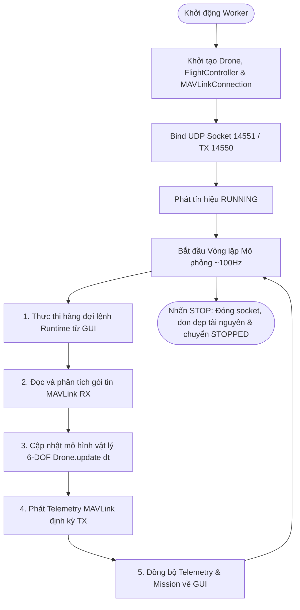
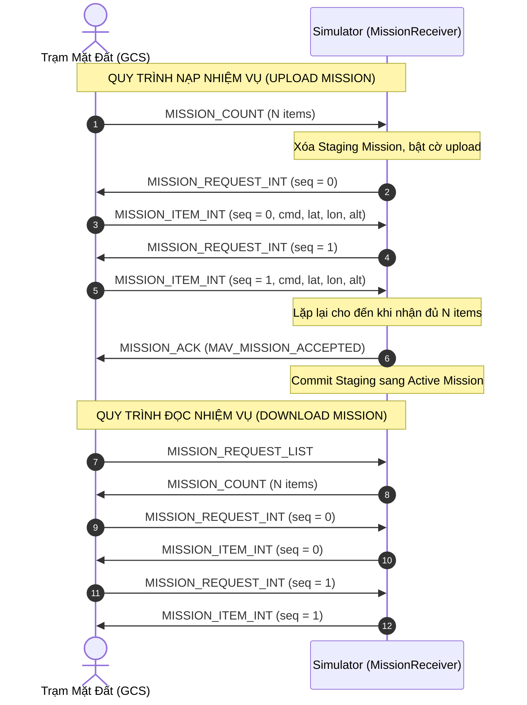

# Giao thức MAVLink trong UAV Drone Simulator

Tài liệu này mô tả chi tiết kiến trúc và phương thức triển khai chuẩn giao thức **MAVLink (Micro Air Vehicle Link)** trong phần mềm mô phỏng, từ tầng truyền tải mạng (Transport Layer), tầng đóng gói bản tin (Frame/Encoding), vòng đời phiên làm việc (Session Lifecycle), cho đến nội dung từng nhóm bản tin Telemetry và Command.

Tài liệu được chuẩn hóa dựa trên các module nguồn thực tế:
- `mavlink/connection.py`: Quản lý UDP Socket phi đồng bộ (Non-blocking I/O).
- `mavlink/telemetry.py`: Tạo và phát định kỳ chuỗi bản tin trạng thái bay (Telemetry Stream).
- `mavlink/messages.py`: Bộ mã hóa các bản tin MAVLink chuẩn.
- `mavlink/command_receiver.py`: Bộ phân tích và thực thi lệnh điều khiển từ GCS.
- `mavlink/mission_receiver.py`: Bộ xử lý giao thức nạp/xuất nhiệm vụ bay (Mission Protocol).
- `gui/simulation_worker.py`: Bộ điều phối luồng chạy mô phỏng vật lý và mạng.

---

## 1. Tầng truyền tải mạng (Transport Layer)

- **Giao thức mạng**: Sử dụng **UDP (User Datagram Protocol)** thuần qua socket tiêu chuẩn `socket.socket(AF_INET, SOCK_DGRAM)` trong Python nhằm đạt độ trễ tối thiểu và tốc độ phản hồi thời gian thực cao.
- **Cơ chế Socket chia sẻ RX / TX**:
  - Socket được ràng buộc (`bind()`) vào địa chỉ lắng nghe RX cục bộ (mặc định `0.0.0.0:14551`).
  - Thiết lập chế độ non-blocking (`setblocking(False)`) để thăm dò và lấy gói tin liên tục trong vòng lặp mô phỏng mà không làm trễ luồng vật lý.
- **Cơ chế tự động ghi nhớ và học địa chỉ GCS (Dynamic Target Learning)**:
  - Khi gửi bản tin (TX), địa chỉ đích được ưu tiên:
    1. Địa chỉ đích chỉ định cụ thể nếu có.
    2. `last_rx_address`: Địa chỉ IP và Port của gói tin GCS gần nhất nhận được.
    3. `tx_address`: Địa chỉ đích mặc định theo cấu hình (mặc định `127.0.0.1:14550`).
  - Nhờ cơ chế này, simulator có thể tự động trả lời chính xác cổng nguồn của bất kỳ GCS nào kết nối đến.

---

## 2. Tầng đóng gói bản tin (Frame & Encoding Layer)

- **Bộ phân tích và mã hóa khung**: Sử dụng bộ giải mã chuẩn của `pymavlink` (`MAVLink(None)`).
- **Định danh hệ thống (Identity)**:
  - `srcSystem` (System ID): Mặc định `1` (có thể điều chỉnh trên giao diện cấu hình).
  - `srcComponent` (Component ID): Mặc định `1` (MAV_COMP_ID_AUTOPILOT1).
- **Quy trình truyền tin (TX - Sending)**:
  - Dữ liệu động học từ `DroneState` được nạp vào hàm mã hóa của bản tin tương ứng (`<msg>_encode`).
  - Đóng gói thành chuỗi byte nhị phân qua phương thức `message.pack(self.mavlink)`.
  - Gửi qua socket mạng bằng `socket.sendto(payload, target_address)`.
- **Quy trình nhận tin (RX - Receiving)**:
  - Dữ liệu thô UDP được phân tích qua hàm `parse_char()` từng byte một để xác thực cấu trúc khung MAVLink (Magic byte, Payload length, Incompatibility flags, Sequence, System ID, Component ID, Message ID, Payload, CRC checksum).
  - Bản tin hợp lệ được đưa vào hàng đợi `_rx_message_queue` để xử lý tuần tự.

---

## 3. Vòng đời phiên làm việc (Session Lifecycle)

Toàn bộ chu trình được điều phối bởi luồng công việc `SimulationWorker` (`QThread`), hoàn toàn tách biệt với luồng giao diện GUI:



---

## 4. Dòng dữ liệu Telemetry (TX: Simulator → GCS)

`MAVLinkTelemetry` quản lý bộ đếm thời gian độc lập để phát các bản tin với chu kỳ tối ưu:

| Tên bản tin MAVLink | Tần số | Nội dung dữ liệu chính | Mục đích sử dụng |
| :--- | :--- | :--- | :--- |
| **`HEARTBEAT`** | 1 Hz | `type=MAV_TYPE_QUADROTOR`, `autopilot=MAV_AUTOPILOT_ARDUPILOTMEGA`, `base_mode` (Cờ `SAFETY_ARMED`), `custom_mode`, `system_status` | Duy trì kết nối sống (Liveness) với GCS và thông báo chế độ bay |
| **`GLOBAL_POSITION_INT`** | 10 Hz | `lat`, `lon` ($10^{-7}\text{ độ}$), `alt`, `relative_alt` ($\text{mm}$), vận tốc 3 trục $v_x, v_y, v_z$ ($\text{cm/s}$), góc la bàn `hdg` ($c\text{deg}$) | Định vị vị trí 3D trên bản đồ vệ tinh của GCS |
| **`ATTITUDE`** | 20 Hz | Góc nghiêng `roll`, `pitch`, `yaw` (Radian) và vận tốc góc `rollspeed`, `pitchspeed`, `yawspeed` | Hiển thị chân trời nhân tạo (Artificial Horizon / PFD) |
| **`GPS_RAW_INT`** | 5 Hz | `fix_type` (3D Fix), tọa độ vệ tinh, `eph` (HDOP), `epv` (VDOP), `vel`, `cog`, `satellites_visible` | Cung cấp thông tin chất lượng định vị GNSS |
| **`BATTERY_STATUS`** | 1 Hz | Điện áp từng cell pin (giả lập 4S), dòng điện tiêu thụ, dung lượng pin còn lại (%) | Hiển thị mức năng lượng và cảnh báo pin yếu |
| **`SYS_STATUS`** | 1 Hz | Cờ trạng thái các cảm biến (Gyro, Accel, Mag, GPS, AHRS), điện áp và tỷ lệ phần trăm tải hệ thống | Giám sát sức khỏe phần cứng |
| **`MISSION_CURRENT`** | $\le 5\text{ Hz}$ | `seq`: Thứ tự điểm Waypoint đang hoạt động trong chu trình | Cập nhật tiến độ bay theo nhiệm vụ trên bản đồ GCS |
| **`MISSION_ITEM_REACHED`**| Khi đến đích | `seq`: Chỉ số Waypoint vừa bay tới thành công (không gửi lặp) | Kích hoạt chuyển bước tiếp theo của lộ trình |

---

## 5. Tiếp nhận & Thực thi lệnh (RX: GCS → Simulator)

Bộ thu lệnh `CommandReceiver` tiếp nhận và chuyển đổi các bản tin lệnh chuẩn MAVLink:

### 5.1. Danh mục lệnh MAV_CMD hỗ trợ

| Lệnh `MAV_CMD` | Mã số | Hành vi thực thi trong Simulator |
| :--- | :--- | :--- |
| `MAV_CMD_COMPONENT_ARM_DISARM` | 400 | `param1 >= 0.5` $\rightarrow$ Mở khóa động cơ (`ARM`), ngược lại khóa (`DISARM`) |
| `MAV_CMD_NAV_TAKEOFF` | 22 | Cất cánh tự động đạt độ cao chỉ định (`param7` hoặc tham số `z`) |
| `MAV_CMD_NAV_LAND` | 21 | Bắt đầu chu trình hạ cánh an toàn thẳng đứng |
| `MAV_CMD_NAV_RETURN_TO_LAUNCH` | 20 | Tự động bay về tọa độ Home ban đầu và hạ cánh |
| `MAV_CMD_MISSION_START` | 300 | Bắt đầu chạy danh sách nhiệm vụ tự động đã nạp |
| `MAV_CMD_DO_SET_MODE` | 176 | Đổi chế độ bay theo chuẩn ArduPilot custom mode (`AUTO`, `GUIDED`, `RTL`, `LAND`, `LOITER`) |

### 5.2. Bản tin vị trí mục tiêu GUIDED (`SET_POSITION_TARGET_GLOBAL_INT`)
- Tiếp nhận tọa độ điểm bay chỉ định trực tiếp từ tính năng "Fly Here / Click to Go" trên GCS.
- Tự động chuyển chế độ bay sang `GUIDED` và điều hướng Drone bay thẳng tới tọa độ mục tiêu.

---

## 6. Giao thức Quản lý nhiệm vụ (MAVLink Mission Protocol)

`MissionReceiver` triển khai đầy đủ cơ chế giao tiếp hai chiều theo chuẩn MAVLink Mission Protocol với kiến trúc **Staging/Commit an toàn**:



### Các tính năng an toàn của Mission Protocol:
- **Hỗ trợ tọa độ độ cao tương đối**: Hỗ trợ chuẩn xác hệ quy chiếu `MAV_FRAME_GLOBAL_RELATIVE_ALT_INT` và `MAV_FRAME_GLOBAL_INT`.
- **Hỗ trợ bước RTL trong Mission**: Tự động liên kết điểm Home khi nhận được lệnh `MAV_CMD_NAV_RETURN_TO_LAUNCH` trong danh sách nhiệm vụ.
- **Kiểm soát chống quá tải**: Từ chối các gói nhiệm vụ bất thường có số lượng Waypoint vượt quá giới hạn an toàn ($> 1000$).
- **Đồng bộ thứ tự Sequence**: Tự động yêu cầu phát lại nếu chỉ số `seq` nhận được không đúng thứ tự mong đợi.

---

## 7. Sơ đồ luồng xử lý toàn diện

```
                        Mạng MAVLink UDP (Socket 14551 / 14550)
GCS (QGC / Mission Planner) ◀══════════════════════════════════════▶ MAVLinkConnection
                                                                           │
                                              ┌────────────────────────────┴────────────────────────────┐
                                              ▼ RX (GCS ➔ Drone)                                        ▲ TX (Drone ➔ GCS)
                                    parse_char() [pymavlink]                                            │
                                              │                                                         │
                               ┌──────────────┴──────────────┐                                          │
                               ▼                             ▼                                          │
                     MissionReceiver                  CommandReceiver                                   │
                (Upload, Download, Clear)     (Arm, Takeoff, Land, RTL, Guided)                         │
                               │                             │                                          │
                               └──────────────┬──────────────┘                                          │
                                              ▼                                                         │
                                         Drone State ◀─────────────────── GUI Manual Controls           │
                                              │                                                         │
                                              ▼                                                         │
                                     Drone.update(dt)                                                   │
                                (Mô hình vật lý 6-DOF & Navigation)                                     │
                                              │                                                         │
                                              └────────────────────────────┬────────────────────────────┘
                                                                           ▼
                                                                  MAVLinkTelemetry
                                                           (Heartbeat, Attitude, Global Pos,
                                                            GPS Raw, Battery, Sys Status...)
```
